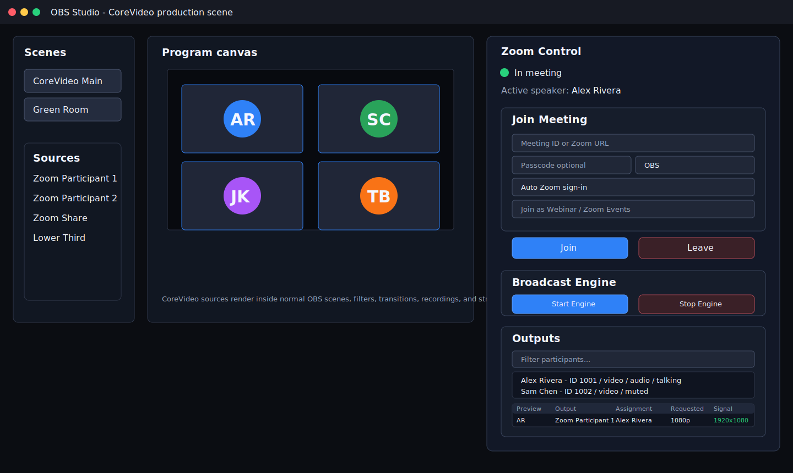
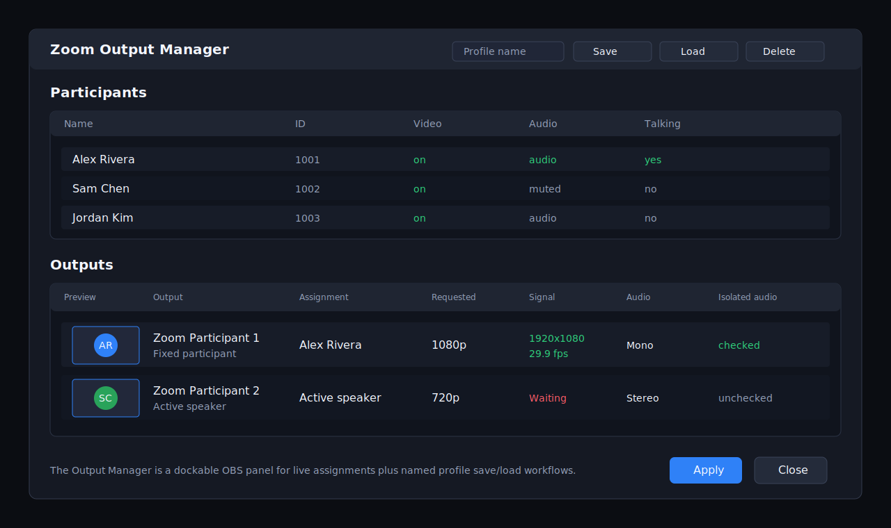

# Core Plugin Functionality

This guide covers the main CoreVideo OBS plugin workflows. It intentionally
focuses on the OBS plugin, `ZoomObsEngine`, Zoom source assignment, control APIs,
audio routing, and ISO recording.

## Media Architecture


CoreVideo keeps all Zoom Meeting SDK access inside the lightweight
`ZoomObsEngine` helper process. The OBS plugin starts the engine, joins the
meeting, and sends subscription requests over JSON IPC. Video and audio payloads
move through named shared memory so large frames are not copied through the IPC
pipe.

The plugin-side `ZoomSource` reads the shared memory frame, outputs it into OBS,
and forwards the same copied buffer to optional plugin-side services such as ISO
recording. This keeps the engine minimal and makes OBS/plugin features easier to
test independently from the Zoom SDK.

## What It Looks Like in OBS

The CoreVideo plugin is operated from inside OBS. These diagrams mirror the
current core plugin controls: the Zoom Control dock, regular OBS scenes/sources,
the Active Speaker Director controls, the separate profile-oriented Zoom Output
Manager, and the Zoom Participant source properties. Exact styling can vary by
OBS theme and platform, but the controls and labels should match the current
plugin.



The Zoom Control dock joins and leaves meetings, starts and stops raw media,
shows meeting state, lists participants, exposes Active Speaker Director
controls, and opens the Output Manager for source assignment without leaving OBS.



The dedicated Zoom Output Manager is the primary assignment surface. It supports
profile save/load workflows and exposes requested resolution, observed signal,
frame rate, assignment mode, and audio routing information for each output.


Each Zoom Participant source can be configured independently for fixed
participants, active speaker, spotlight slot, screen share, isolated audio,
audience audio, resolution, video-loss behavior, and hardware conversion.

## Joining Meetings

1. Open OBS.
2. Open **Tools > Zoom Control**.
3. Enter a Zoom meeting ID or full Zoom join URL.
4. Enter a display name.
5. Use **Auto Zoom sign-in / ZAK** unless Zoom support gives you a specific ZAK.
6. Click **Join**.
7. Click **Start Engine** after joining to request raw media from Zoom.

For external-account meetings, configure OAuth in **Tools > Zoom Plugin
Settings**. CoreVideo uses the OAuth login to fetch a short-lived ZAK from
`/v2/users/me/zak` and passes that ZAK to the Meeting SDK join parameters.

## Source Assignment

Add one or more **Zoom Participant** sources in OBS. Each source can follow a
different assignment mode:

| Mode | Behavior | Common Use |
|---|---|---|
| Participant | Fixed Zoom participant ID | Dedicated guest ISO |
| Active Speaker | Follows the current active speaker | Host/speaker-follow shot |
| Spotlight Slot | Follows Zoom spotlight position 1..N | ZoomISO-style production |
| Screen Share | Follows active screen share | Slides/demo capture |

Each output reports observed resolution and frame rate through the output
manager and TCP `list_outputs` command.

For a single directed speaker-follow output, add the dedicated **CoreVideo Active
Speaker** OBS source. It follows the central Active Speaker Director and uses a
two-slot handoff internally: the current participant remains visible while the
next participant warms on a hidden slot, then the source cuts only after a valid
frame is available.

## Active Speaker Director

The Active Speaker Director is controlled from the Zoom Control dock. It is not
just a pass-through of Zoom's raw active-speaker event; it builds CoreVideo's own
production decision from the raw speaker signal.

The dock shows:

- Directed speaker: the participant currently being sent to active-speaker
  outputs.
- Raw speaker: the latest speaker reported by Zoom.
- Candidate speaker: the participant waiting out the sensitivity timer.
- Last speaker: the previously directed participant.
- Manual take/release: an operator supersede that holds a participant on air
  until released.

Timing controls:

| Setting | Default | Behavior |
|---|---|---|
| Sensitivity | 500 ms | Candidate must keep speaking this long before switching. |
| Hold | 2000 ms | Minimum time to stay on the current directed speaker after a cut. |

TCP examples:

```json
{"cmd":"speaker_director_status"}
```

```json
{"cmd":"speaker_director_configure","sensitivity_ms":650,"hold_ms":2500}
```

```json
{"cmd":"speaker_director_take","participant_id":123456}
```

```json
{"cmd":"speaker_director_release"}
```

## Audio Routing

CoreVideo supports three audio modes for participant outputs:

| Routing | Behavior |
|---|---|
| Mixed | Full meeting mix |
| Isolated | Only the assigned participant's one-way audio |
| Audience | Residual one-way audio for participants not assigned to isolated outputs |

Use **Isolated** when you need the assigned participant only. Use **Audience**
for a remaining-room or overflow mic channel after dedicated isolated sources
have claimed named participants.

## Auto ISO Recording


ISO recording is controlled by the OBS plugin, not the engine. When enabled,
CoreVideo records one video file and one PCM WAV audio file per active source
segment. A new segment starts when the resolved participant or source resolution
changes.

Requirements:

- `ffmpeg` must be available on `PATH`, or pass an explicit `ffmpeg_path`.
- Raw media must be active.
- Sources must be assigned to participant, active speaker, or spotlight modes.

### OBS ISO Recorder Panel

Open **Tools > Zoom ISO Recorder** to manage ISO recording from a separate OBS
dock. The panel provides:

- Output folder picker.
- FFmpeg executable field with a test button.
- **Also start/stop OBS program recording** toggle.
- **Start ISO Recording** and **Stop ISO Recording** buttons.
- Live status showing idle/recording and active session count.
- Active session table with source, participant, resolution, video frame count,
  audio chunk count, and the current video/audio file paths.

The panel uses the same `ZoomIsoRecorder` backend as the TCP and OSC APIs. It
persists the output folder, FFmpeg path, and program-recording toggle in OBS
global settings.

TCP start example:

```json
{"cmd":"iso_recording_start","output_dir":"C:/Recordings/CoreVideo","ffmpeg_path":"ffmpeg","record_program":true}
```

TCP status example:

```json
{"cmd":"iso_recording_status"}
```

TCP stop example:

```json
{"cmd":"iso_recording_stop"}
```

OSC equivalents:

| Address | Type tags | Action |
|---|---|---|
| `/zoom/iso/start` | optional `,s` | Start ISO recording, optional output directory |
| `/zoom/iso/stop` | none | Stop ISO recording |

Output files are written as:

- `*.mp4` for encoded I420 video through FFmpeg/libx264
- `*.wav` for matching PCM audio

When `record_program` is true, CoreVideo also starts the normal OBS program
recording and stops it when ISO recording stops, but only if CoreVideo started
that OBS recording session.

## TCP Control Examples

All TCP commands are newline-delimited JSON sent to `127.0.0.1:19870`.

List participants:

```json
{"cmd":"list_participants"}
```

List outputs:

```json
{"cmd":"list_outputs"}
```

Output snapshots include requested resolution, observed resolution/FPS, stale
state, last frame age, subscribed age for outputs still waiting on their first
frame, recovery attempts, automatic quality-upgrade attempts, and remaining
retry cooldowns.

Force a retry for stale outputs:

```json
{"cmd":"recover_stale_outputs","force":true}
```

Force a quality retry for live outputs below their requested resolution:

```json
{"cmd":"upgrade_low_quality_outputs","force":true}
```

Quality retries are skipped when a feed is already observed at 1080p.

Assign a source to a fixed participant with isolated mono audio:

```json
{"cmd":"assign_output_ex","source":"Zoom Participant 1","mode":"participant","participant_id":123456,"isolate_audio":true,"audio_channels":"mono","video_resolution":"1080p"}
```

Assign a source to active speaker:

```json
{"cmd":"assign_output_ex","source":"Zoom Participant 2","mode":"active_speaker","audio_channels":"mono","video_resolution":"1080p"}
```

Inspect and control the Active Speaker Director:

```json
{"cmd":"speaker_director_status"}
```

```json
{"cmd":"speaker_director_configure","sensitivity_ms":650,"hold_ms":2500}
```

```json
{"cmd":"speaker_director_take","participant_id":123456}
```

```json
{"cmd":"speaker_director_release"}
```

Assign a source to spotlight slot 1:

```json
{"cmd":"assign_output_ex","source":"Zoom Participant 3","mode":"spotlight","spotlight_slot":1,"audio_channels":"mono","video_resolution":"1080p"}
```

## OSC Control Examples

List participants and outputs:

```text
/zoom/list_participants
/zoom/list_outputs
```

Retry stale video outputs:

```text
/zoom/recover_stale_outputs 1
```

Retry low-quality video outputs:

```text
/zoom/upgrade_low_quality_outputs 1
```

Assign a source:

```text
/zoom/output/assign_ex "Zoom Participant 1" "participant" 123456 1
```

Assign active speaker:

```text
/zoom/assign_output/active_speaker "Zoom Participant 1"
```

Set isolated audio:

```text
/zoom/isolate_audio "Zoom Participant 1" 1
```

Start and stop ISO recording:

```text
/zoom/iso/start "C:/Recordings/CoreVideo"
/zoom/iso/stop
```

## Troubleshooting

| Symptom | Check |
|---|---|
| Color bars only | Confirm the meeting is joined, raw media is started, and the source has a participant/role assignment. |
| No isolated audio | Confirm the source is assigned to a real participant and `isolate_audio` is true. |
| ISO recording does not start | Confirm `ffmpeg` is on PATH or provide `ffmpeg_path`. |
| External meeting rejected | Confirm the Meeting SDK app/client ID is approved or published for external meeting joins. |
| Plugin cannot launch engine | Confirm `ZoomObsEngine.exe` and Zoom SDK runtime DLLs are installed under `obs-plugins/64bit/zoom-runtime`. |
