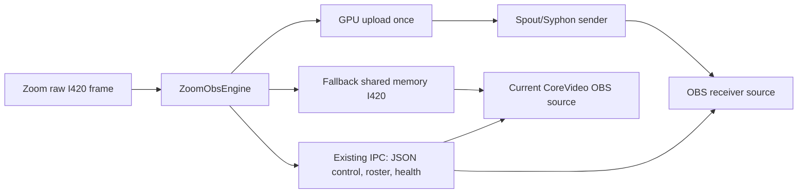

# GPU Texture Sharing Research

This note tracks the future option of moving high-density video transport from
CPU shared memory to local GPU texture sharing.

## Current CoreVideo Transport

Today the engine writes I420 frames into named shared memory. The OBS plugin
reads the shared-memory frame, converts/uploads it for rendering, and may also
copy the same frame into plugin-side services such as ISO recording.

This design is portable and debuggable, but it creates local memory bandwidth
pressure at 8+ 1080p feeds. Zoom bandwidth can be healthy while the local
machine still spends too much time copying and converting full frames.

## Candidate Technologies

### Windows: Spout / Spout2

Spout is a Windows texture-sharing system. The current Spout project describes
support for DirectX 9, DirectX 11, DirectX 12, and OpenGL textures, with SDK and
sample applications. Existing OBS Spout plugins can receive a Spout shared
texture as an OBS source.

Relevant links:

- https://leadedge.github.io/
- https://github.com/leadedge/Spout2
- https://github.com/Off-World-Live/obs-spout2-plugin

### macOS: Syphon

Syphon is a macOS framework for sharing frames between applications in real
time, using hardware-accelerated surface sharing on the GPU. It is the closest
macOS analogue to the Spout direction.

Relevant links:

- https://syphon.info/
- https://github.com/Syphon/Syphon-Framework

## Proposed Architecture

Keep the current IPC contract for control, participant metadata, assignments,
health, diagnostics, and fallback frame transport. Add an optional pixel
transport layer:

1. Engine receives Zoom raw video.
2. Engine uploads each active participant frame to a GPU texture.
3. Engine publishes one sender per CoreVideo output or per Zoom participant.
4. OBS side either:
   - consumes that sender through an existing Spout/Syphon OBS plugin, or
   - uses a dedicated CoreVideo receiver source.
5. Shared memory remains available as the fallback path and for platforms where
   the GPU texture path is not implemented.

## Expected Benefits

- Reduce repeated CPU copies for many 1080p sources.
- Reduce memory bandwidth pressure when multiple OBS sources subscribe to live
  participant feeds.
- Keep OBS rendering on the GPU once the frame is uploaded.
- Preserve the existing control protocol and diagnostics.

## Risks And Constraints

- Platform-specific implementation: Spout is Windows-focused; Syphon is macOS.
- Multi-GPU systems can fail if the sender and receiver are not on the same GPU.
- OBS plugin dependency choices need care: relying on third-party receiver
  plugins makes install simpler for CoreVideo but less controlled; writing a
  dedicated receiver gives better diagnostics but costs more engineering time.
- ISO recording still needs CPU-accessible frame/audio data unless the recorder
  path is also redesigned.
- Existing named shared memory remains necessary for debugging, fallback, and
  non-GPU environments.

## Recommended Phases

1. **Prototype outside production path**
   - Build a Windows-only experimental Spout sender in the engine.
   - Publish one synthetic sender and one live participant sender.
   - Consume it in OBS with an existing Spout receiver plugin.

2. **Measure**
   - Compare CPU, memory bandwidth, frame age, and dropped frames against the
     current shared-memory path using `scripts/Measure-CoreVideoLoad.ps1`.
   - Test 2, 4, and 8 active 1080p feeds.
   - Test single-GPU and dual-GPU systems.

3. **Integrate as optional transport**
   - Add a per-source or global transport selector: `Shared memory` or
     `GPU texture experimental`.
   - Keep health/diagnostics visible in Zoom Diagnostics.
   - Automatically fall back to shared memory on sender/receiver failure.

4. **Decide production path**
   - If measurements are materially better and stability is acceptable, build a
     dedicated CoreVideo OBS receiver source.
   - If not, keep the work as an advanced experimental option and continue
     optimizing the shared-memory pipeline.

## Non-Goals For The First Prototype

- No change to Zoom auth/join.
- No change to the existing JSON IPC schema.
- No removal of shared memory.
- No ISO recorder rewrite.
- No Sidecar dependency.
